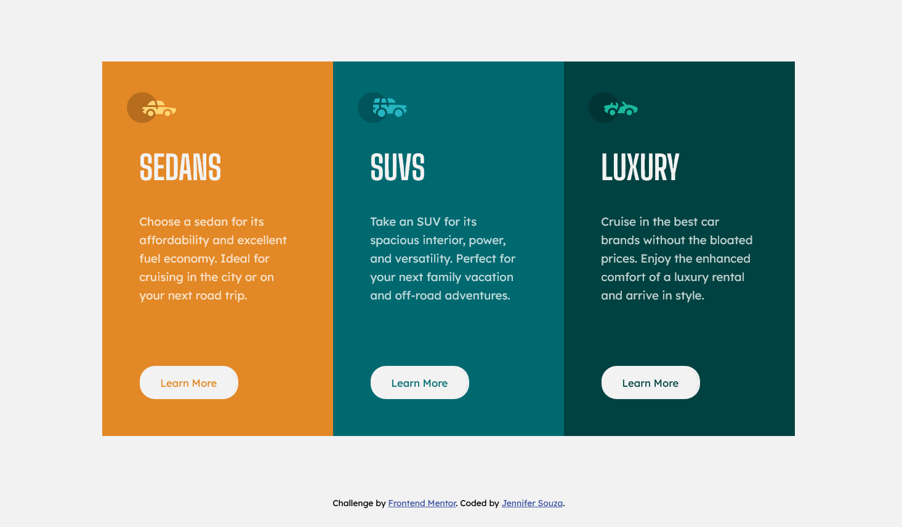

# Frontend Mentor - 3-column preview card component solution

This is a solution to the [3-column preview card component challenge on Frontend Mentor](https://www.frontendmentor.io/challenges/3column-preview-card-component-pH92eAR2-). Frontend Mentor challenges help you improve your coding skills by building realistic projects. 

## Table of contents

- [Overview](#overview)
  - [The challenge](#the-challenge)
  - [Screenshot](#screenshot)
  - [Links](#links)
- [My process](#my-process)
  - [Built with](#built-with)
  - [What I learned](#what-i-learned)
  - [Continued development](#continued-development)
  - [Useful resources](#useful-resources)
- [Author](#author)

## Overview
Mobile-first responsive three-column card component using css grid.

### The challenge

Users should be able to:

- View the optimal layout depending on their device's screen size
- See hover states for interactive elements

### Screenshot

### Links

- Solution URL: [Add solution URL here](https://your-solution-url.com)
- Live Site URL: [Add live site URL here](https://your-live-site-url.com)

## My process
- Code the HTML and make sure page has solid structure
- Grab fonts/import from Google Fonts
- Copy colors from design spec into stylesheet and make them variables for better readability
- Code css for mobile layout, and colors/typography etc
- Test 
- Add media query and code desktop layout
- Test, double checking for any additional breakpoints
- Fix any breakpoints if needed, test again

### Built with

- CSS custom properties (for color readability)
- CSS Grid
- Mobile-first workflow

### What I learned

I learned that responsive layouts are kind of tricky when you have a specification for number of columns - there's an almost breakpoint viewing it in 600-800px wide screensize where the single column stretches beyond what I would prefer, but three columns are too squished, and I didn't want to wrap the cards. I also was reminded that margin 0 auto only works when you give the parent a fixed width.

### Continued development

Keep practicing with grid - autofit, min-max, etc. Keep practicing using rem and em units until it gets more intuitive for me. 

## Useful resources

Kevin Powell's css grid patterns cheatsheet: https://simple-grid-layout.kevinpowell.co/
MDN CSS Grid docs: https://developer.mozilla.org/en-US/docs/Web/CSS/grid

## Author

[Jennifer Souza](https://github.com/zoedarkweather)
- Frontend Mentor - [@zoedarkweather](https://www.frontendmentor.io/profile/zoedarkweather)

